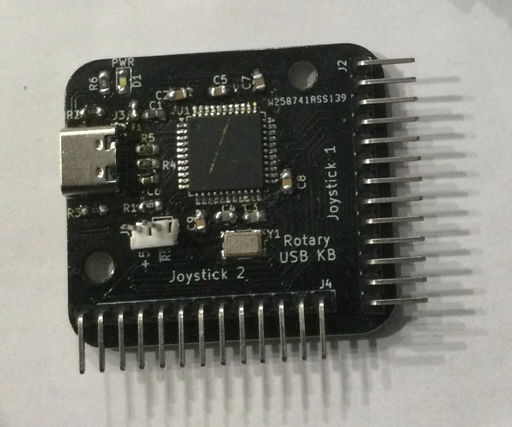

# Rotary_USB
LS30 to MAME Interface  
    
Uses an ATMega32u4 with a Sparkfun Pro Micro bootloader 
to read 1 or 2 rotary joysticks and send out a clockwise or counter-clockwise keystroke when movement occurs.
